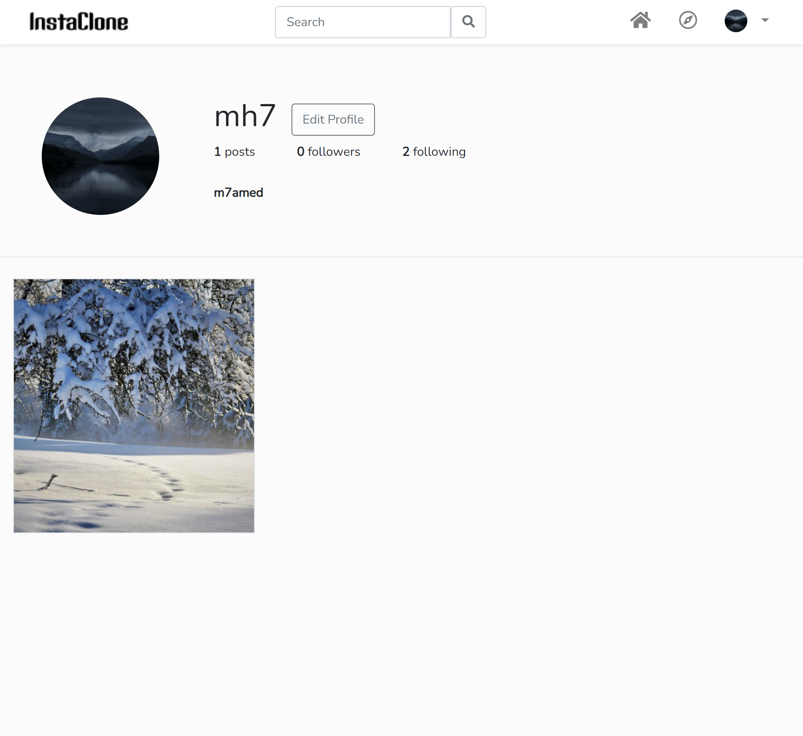

# InstaClone

An Instagram Clone using Laravel

## Getting started

1. Install composer `composer install`
2. Install npm package `npm install`
3. Copy and edit .env file from .env.example `cp .env.example .env`
4. Generate project key `php artisan key:generate`
5. Create an empty database `instgram` for example
6. In the .env file, change database information `DB_DATABASE=instgram`
7. Migrate the database `php artisan migrate`
8. Create symbolic link for storage `php artisan storage:link`
9. Run project `php artisan serve`
